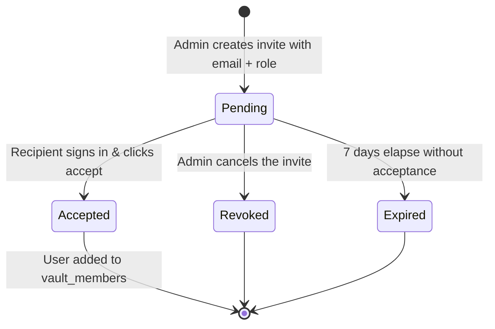

# Architecture Design Document: Workspace Invites & Role-Based Access Control (RBAC)

**Project:** VicharHub  
**Author:** Anuj Adhikari  
**Status:** Approved for Implementation  
**Version:** 1.0  

---

## 1. Executive Summary & Problem Statement

Currently, in VicharHub:
- Vaults are owned by a single `user_id` (`vaults.user_id = user.id`).
- Only the creator of a vault can read, modify, or delete its documents and spreadsheets.
- If two teammates or students want to collaborate on the same workspace, they currently have no mechanism to share the vault or control who has administrative power versus editing or viewing rights.

This document outlines the architecture, data models, security guarantees, lifecycle states, and API endpoints for:
1. **Workspace Invites**: Secure invitation flows with time-bounded, cryptographically random tokens and email targeting.
2. **Role-Based Access Control (RBAC)**: Fine-grained permission matrices enforcing separation of duties between **Owner**, **Admin**, **Member**, and **Viewer**.

---

## 2. Core Concepts Explained Simply

```
                             [ Vault / Workspace ]
                                       │
        ┌───────────────────┬──────────┴──────────┬──────────────────┐
        ▼                   ▼                     ▼                  ▼
    [ Owner ]            [ Admin ]             [ Member ]         [ Viewer ]
  Full ownership,    Invite & manage,      Read & write pages,    Read-only,
  billing, transfer,   edit documents,       edit sheets, live     comment, no edits,
  vault deletion       cannot delete vault   cannot invite/kick   cannot delete
```

### The Three Fundamental Entities:
1. **Subject (Who?)**: The authenticated user (`user_id`, `email`, `name`).
2. **Resource (What?)**: The vault, its pages, and collaborative Liveblocks rooms.
3. **Action (How?)**: What operation the user wants to perform (`read`, `create`, `update`, `delete`, `invite`, `manage_roles`).

### Role Definitions:
- **`owner`**: The vault creator. Has all capabilities, including destructive actions (deleting the vault) and transferring ownership. There is strictly **1 owner** per vault.
- **`admin`**: Trusted collaborator. Can invite new members, change roles of members/viewers, remove members, and edit/create pages. Cannot delete the vault or demote/remove the owner.
- **`member`**: Standard contributor. Can create, edit, duplicate, favorite, and trash pages or edit spreadsheet cells. Cannot invite others, modify vault settings, or manage roles.
- **`viewer`**: Read-only collaborator. Can view pages, browse the document tree, and observe real-time spreadsheets/docs. Cannot modify titles, content, or settings.

---

## 3. Permission Matrix (RBAC)

| Action | Owner | Admin | Member | Viewer |
| :--- | :---: | :---: | :---: | :---: |
| **View Pages & Spreadsheets** |  Yes |  Yes |  Yes |  Yes |
| **Liveblocks Presence & Cursor** |  Yes |  Yes |  Yes |  Yes |
| **Create New Page / Spreadsheet** |  Yes |  Yes |  Yes |  No |
| **Edit Page Content & Title** |  Yes |  Yes |  Yes |  No |
| **Edit Spreadsheet Cells & Formulas** |  Yes |  Yes |  Yes |  No |
| **Add / Delete Sheets (Tabs)** |  Yes |  Yes |  Yes |  No |
| **Trash / Restore / Duplicate Page** |  Yes |  Yes |  Yes |  No |
| **Export JSON / CSV Backup** |  Yes |  Yes |  Yes |  Yes |
| **Invite New Collaborator** |  Yes |  Yes |  No |  No |
| **Revoke Pending Invites** |  Yes |  Yes |  No |  No |
| **Change Member Role (Member $\leftrightarrow$ Viewer)** |  Yes |  Yes |  No |  No |
| **Promote Member to Admin** |  Yes |  No |  No |  No |
| **Remove Collaborator (Kick)** |  Yes |  Yes* |  No |  No |
| **Rename Vault** |  Yes |  Yes |  No |  No |
| **Delete Vault Entirely** |  Yes |  No |  No |  No |
| **Transfer Ownership** |  Yes |  No |  No |  No |

*\*Admins can remove Members and Viewers, but cannot remove the Owner or other Admins.*

---

## 4. Invitation Lifecycle & State Machine



### Lifecycle States:
1. **Creation**:
   - An Admin/Owner submits recipient's email (`user@example.com`) and target role (`admin`, `member`, `viewer`).
   - A cryptographically secure random token (32 bytes hex) is generated.
   - An expiration date is set (default: 7 days from creation).
   - Saved with status `pending`.
2. **Acceptance**:
   - Recipient accesses the invite link (`https://vicharhub.workers.dev/invite/<token>`).
   - If user is not authenticated, they sign in or sign up first.
   - Server verifies:
     - Token exists and has status `pending`.
     - `expires_at > current_timestamp`.
     - Optional check: email matches or user accepts with their logged-in account.
   - Server inserts recipient into `vault_members` with the assigned role.
   - Invite status transitions to `accepted`.
3. **Revocation & Expiry**:
   - If an invite is no longer desired, the Admin can click "Revoke", transitioning status to `revoked`.
   - Any access after 7 days is rejected with `410 Gone` (Invite Expired).

---

## 5. Database Schema (Cloudflare D1 SQLite)

```sql
-- 1. Vault Members: Junction table associating users with vaults and roles
CREATE TABLE IF NOT EXISTS vault_members (
  id         TEXT PRIMARY KEY,
  vault_id   TEXT NOT NULL REFERENCES vaults(id) ON DELETE CASCADE,
  user_id    TEXT NOT NULL REFERENCES users(id) ON DELETE CASCADE,
  role       TEXT NOT NULL CHECK (role IN ('owner', 'admin', 'member', 'viewer')),
  created_at INTEGER NOT NULL DEFAULT (unixepoch()),
  UNIQUE(vault_id, user_id)
);

CREATE INDEX IF NOT EXISTS idx_vault_members_user  ON vault_members(user_id);
CREATE INDEX IF NOT EXISTS idx_vault_members_vault ON vault_members(vault_id);

-- 2. Vault Invites: Secure invite tokens and metadata
CREATE TABLE IF NOT EXISTS vault_invites (
  id         TEXT PRIMARY KEY,
  vault_id   TEXT NOT NULL REFERENCES vaults(id) ON DELETE CASCADE,
  inviter_id TEXT NOT NULL REFERENCES users(id) ON DELETE CASCADE,
  email      TEXT NOT NULL COLLATE NOCASE,
  role       TEXT NOT NULL CHECK (role IN ('admin', 'member', 'viewer')),
  token_hash TEXT NOT NULL UNIQUE,
  status     TEXT NOT NULL DEFAULT 'pending' CHECK (status IN ('pending', 'accepted', 'revoked', 'expired')),
  expires_at INTEGER NOT NULL,
  created_at INTEGER NOT NULL DEFAULT (unixepoch())
);

CREATE INDEX IF NOT EXISTS idx_vault_invites_token ON vault_invites(token_hash);
CREATE INDEX IF NOT EXISTS idx_vault_invites_vault ON vault_invites(vault_id);
```

### Migration Backfill:
For all existing vaults in the database:
```sql
INSERT OR IGNORE INTO vault_members (id, vault_id, user_id, role, created_at)
SELECT 'vm_' || id, id, user_id, 'owner', created_at FROM vaults;
```
This guarantees 100% backward compatibility for all existing user data.

---

## 6. API Specification

### A. Invites
- `POST /api/vaults/:vaultId/invites`
  - **Required Role**: `owner` or `admin`
  - **Body**: `{ "email": "teammate@company.com", "role": "member" }`
  - **Response**: `{ "id": "...", "inviteUrl": ".../invite/<token>", "expiresAt": ... }`
- `GET /api/vaults/:vaultId/invites`
  - **Required Role**: `owner` or `admin`
  - **Response**: List of pending invites for the vault.
- `DELETE /api/vaults/:vaultId/invites/:inviteId`
  - **Required Role**: `owner` or `admin`
  - **Response**: `{ "success": true }` (marks status as `revoked`).
- `GET /api/invites/:token`
  - **Public endpoint**: Returns vault name and inviter name for previewing the invite.
- `POST /api/invites/:token/accept`
  - **Requires**: Authenticated user.
  - **Response**: `{ "vaultId": "...", "role": "..." }` and joins user to vault.

### B. Members & Roles
- `GET /api/vaults/:vaultId/members`
  - **Required Role**: Any member of the vault (`owner`, `admin`, `member`, `viewer`).
  - **Response**: `[{ "id": "...", "userId": "...", "name": "...", "email": "...", "role": "admin" }]`
- `PATCH /api/vaults/:vaultId/members/:userId`
  - **Required Role**: `owner` (can change any role) or `admin` (can change `member` $\leftrightarrow$ `viewer`).
  - **Body**: `{ "role": "admin" | "member" | "viewer" }`
- `DELETE /api/vaults/:vaultId/members/:userId`
  - **Required Role**: `owner` or `admin` (or user leaving the vault themselves).

---

## 7. Security Best Practices
1. **Never Store Plaintext Tokens**: Tokens are hashed with SHA-256 before storing in the database (`token_hash`), preventing leaks if the database is dumped.
2. **Server-Side Authorization Everywhere**: The client UI only hides/disables buttons for UX; every single backend endpoint enforces the permission check via SQLite queries (`getUserVaultRole()`).
3. **No Self-Demotion of Last Owner**: The vault owner cannot delete themselves or demote their role without transferring ownership first.
4. **Tenant Isolation**: Users can never view or modify pages outside the vaults where they are verified members.
